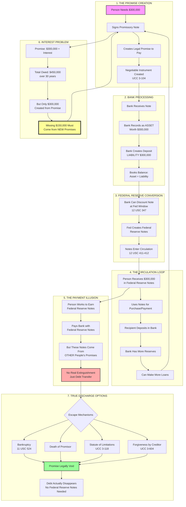
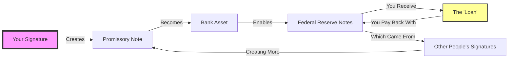
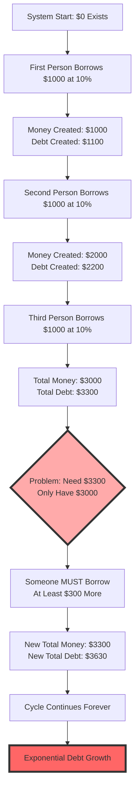
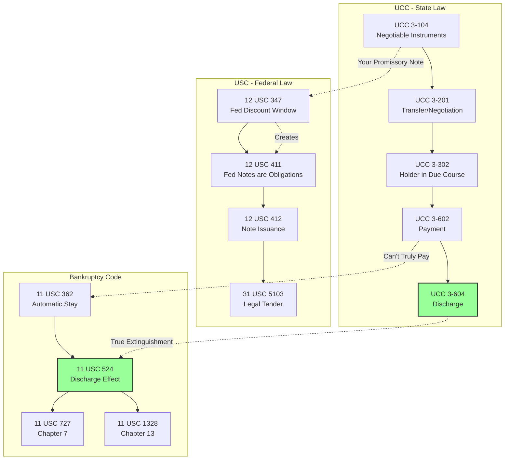
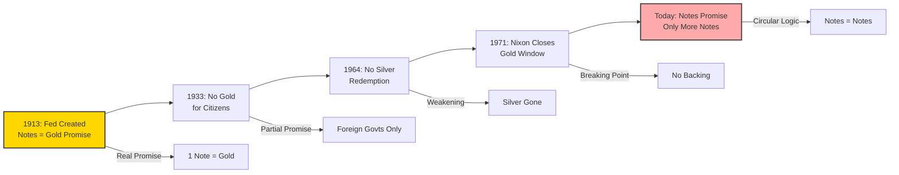
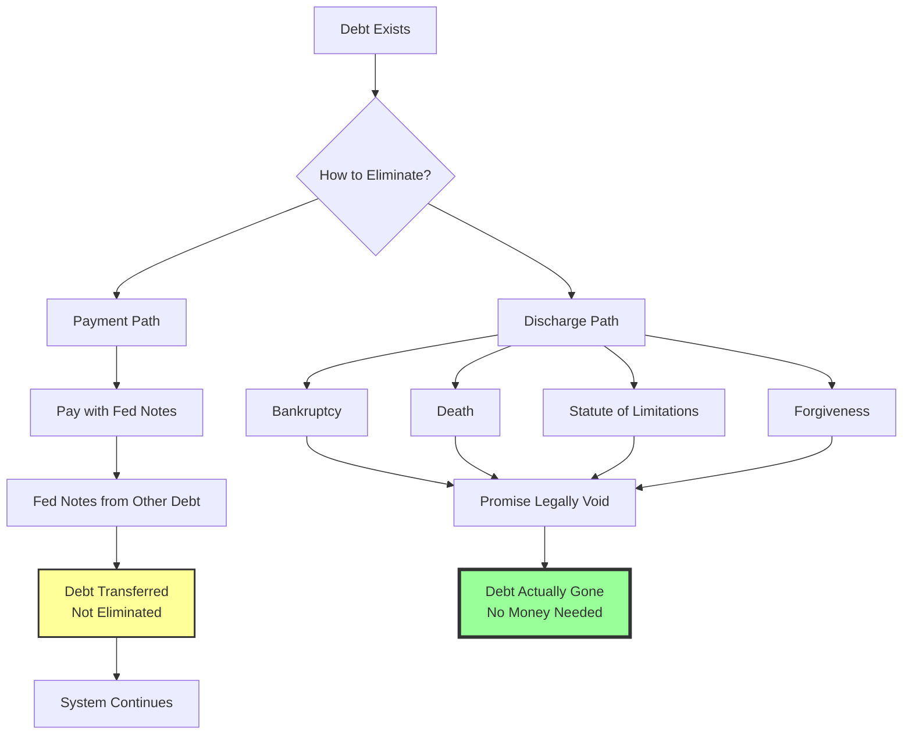
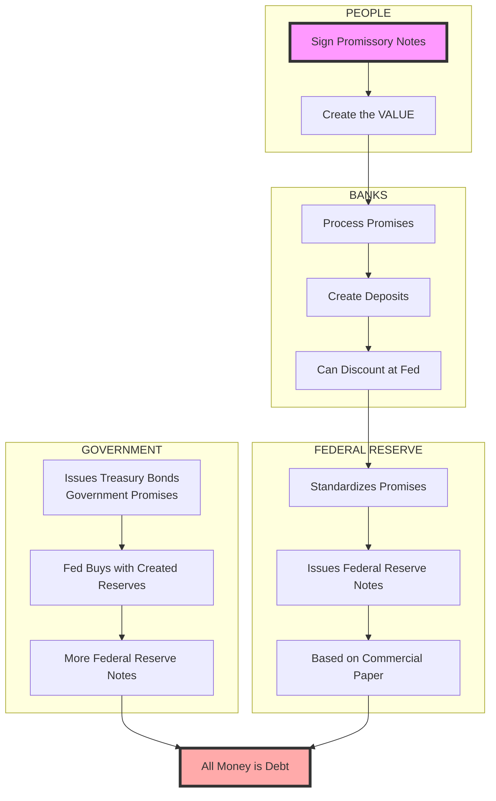
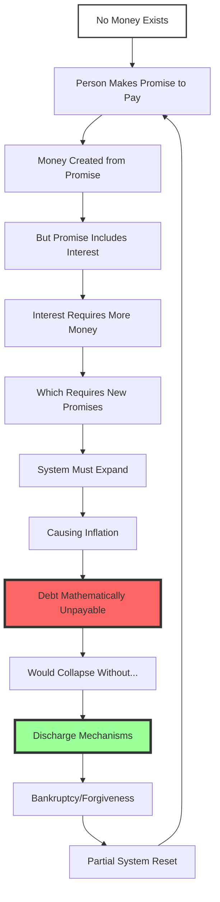

# Money Creation Flow Chart: From Promises to Federal Reserve Notes

## Complete System Overview

## Simplified Money Creation Cycle

## The Mathematical Impossibility

## Legal Framework Connections

## Historical Timeline of Money

## The Debt Discharge Mechanisms

## Who Creates What

## The Complete Picture

---

*These charts visualize the hidden architecture of money creation, showing how promissory notes become Federal Reserve Notes, why debt must perpetually expand, and why discharge (not payment) is the only true debt extinguishment.*